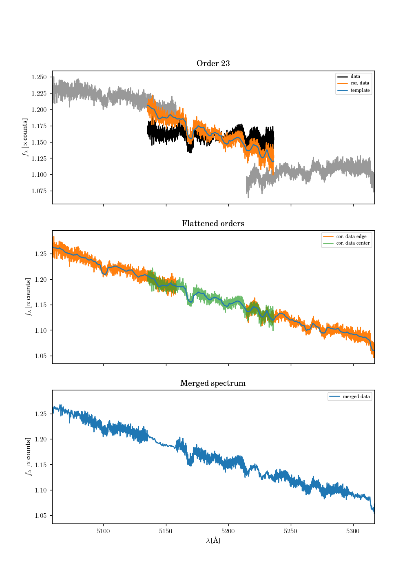

# tresmerge
Pseudo-flux calibrate and merge TRES echelle spectra

## Citations

If you make use of this code, please cite this repository as

    @misc{tresmerge_czekala,
      author       = {Ian Czekala},
      title        = {iancze/tresmerge: beta},
      month        = sep,
      year         = 2018,
      doi          = {10.5281/zenodo.1411998},
      url          = {https://doi.org/10.5281/zenodo.1411998}
    }

This package requires Python 3 and the following packages:

* numpy
* scipy
* matplotlib
* astropy
* astropy/specutils: https://github.com/astropy/specutils

You can try installing these individually yourself beforehand, or the installation process should be able to install them all for you.

## Installation

Download this package, `cd` to the directory, and run

    $python setup.py install

or

    $python3 setup.py install

If you're on a system without administrative priveledges, you might need to add the `--user` flag to the above command. Also, take a look at the commands that are printed out after the install command, since you may need to add the scripts directory to your system PATH. In my case, I needed to add the `/home/iczekala/.local/bin` directory to my `.cshrc` file.

Make sure that `python` or `python3` points to the Python 3 version you want to use. You can check that this is the correct version by first entering the Python interpreter, and you should see something like

    $ python
    Python 3.6.3 |Anaconda custom (64-bit)| (default, Nov  3 2017, 19:19:16)
    [GCC 7.2.0] on linux
    Type "help", "copyright", "credits" or "license" for more information.
    >>>

These scripts have not been tested with Python 2.x and will likely not work. It's recommended you upgrade to Python 3.

The main script that you should use to run everything is called `tresmerge-process`, e.g.,

    $ tresmerge-process --help
    usage: tresmerge-process [-h] [--outfile OUTFILE] [--clobber] [--plot]
                         [-t TRIM] [--shift SHIFT] [--poly-order POLY_ORDER]
                         rfits bfits template

    Merge TRES echelle orders.

    positional arguments:
      rfits                 Name of the FITS file containing the RAW spectrum to
                            merge.
      bfits                 Name of the FITS file containing the BLAZE-corrected
                            spectrum to merge.
      template              Name of the FITS file containing the Kurucz template
                            spectrum.

    optional arguments:
      -h, --help            show this help message and exit
      --outfile OUTFILE     Name of the output file to write the merged echelle
                            spectrum to.
      --clobber             Overwrite any existing output file with new data.
      --plot                Make a set of plots of the merged spectra.
      -t TRIM, --trim TRIM  How many pixels to trim from the front of the file.
                            Default is 6
      --shift SHIFT         Doppler shift the synthetic spectrum by this amount
                            (in km/s) before doing the merge process. This may
                            help if the target star has an exceptionally high
                            radial velocity. Positive velocities correspond to
                            redshifting the template.
      --poly-order POLY_ORDER
                            The order Chebyshev polynomial used to flatten each
                            echelle order. 0 = constant, 1 = line, 2 = parabola, 3
                            = cubic, ... etc.

## Updating your package

If you've previously installed this package, and there's been a new update, here is how you can proceed. If you used `git` to download this package, first `cd` to the repository and run

    $ git pull

This command will use git to bring down all of the new changes. Then, run

    $python setup.py install

again to install these changes to your system. If you didn't use `git` to download the package in the first place, you can delete the repository, download a new `.zip` package, and install it as before.

## How this package works

This purpose of this code is to merge overlapping echelle orders of TRES spectrograph data into a single spectrum. Where there is no data in the redder echelle gaps, the code leaves no-data (despite what may appear as plotting artifacts).

The data in each echelle order is compared to a synthetic template spectrum that the user provides. The mismatch is accounted for by fitting an `n`-th order (user specifies `n`) polynomial to the data and flattening it until it matches the template.

The output is written to an enhanced-CSV file, which can be read by `astropy.io.ascii`, or any CSV reader. The header values in the original FITS files are copied as comments.

### Usage

For example, if you had two directories each containing the raw and blaze-corrected spectra, and a template, then you would run the code like this

    $ tresmerge-process raw/hii468_2017-11-23_04h35m56s_cb.spec.fits blaze/hii468_2017-11-23_04h35m56s_cb.spec.fits t12000g40p00v180s.fits --plot

If you enabled plotting (via `--plot`), then you should see an `output.pdf` with the spectra. You should also see an outfile containing the merged spectrum as a text file.

## Notes about quality of merging

For orders with deep absorption lines, the quality of fit of the synthetic spectra to the data makes a difference. Because the polynomial-fitting process seeks to minimize the distance between the synthetic spectra and data for each order, if the template has a number of inaccurate lines, then the polynomial fit will be biased. Future plans for this package may include adding in a masking option to do the polynomial fitting while excluding user-specified regions of the template, so please contact me or raise an issue on this repo if such a feature extension would be helpful.
